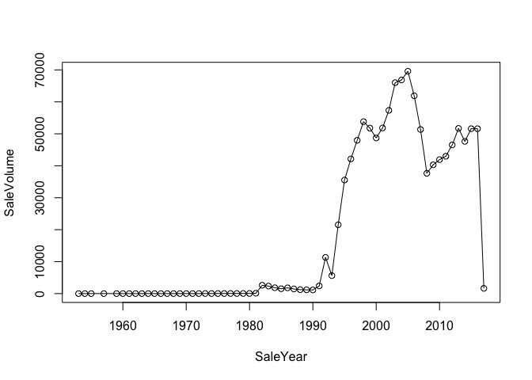
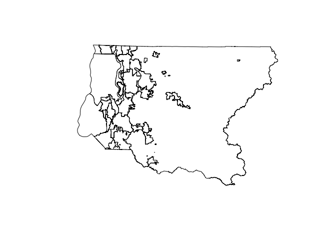
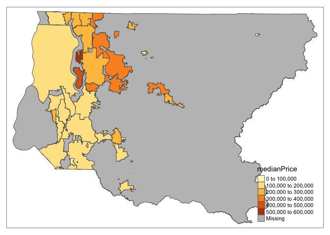
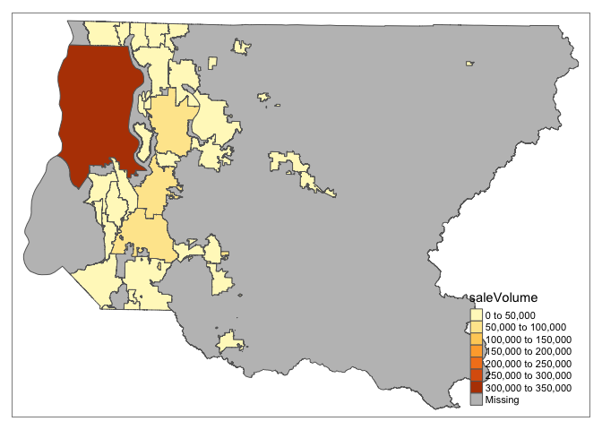

Can Tech Giants Affect Residential House Sale Price?
================
Liyuan Zhang
2/26/2017

<br>

------------------------------------------------------------------------

THE OUTLINE
-----------

<br> People have been complaining about the rising house price in Seattle and some attribute that to the rapid growth of the tech industry. In this report, I will use the officially recorded house sale panel data from King County to explore whether this holds true.

To check whether people are complaining based on truth or just personal perceptions, I have derived two questions to be answered:

1.  In which King County district and in which year, has there been an exceptionally large jump in residential house sale price or residential house sale volume?

2.  Is there a valid causal relationship to confidently attribute the jump to the growth of tech industry?

In this mid-review report, I will only finish with a comparison of the sale volume and median sale price of 39 King County Districts.

The core varaibles I need for the this question are: residential house sale price, the sale volume within a period, the time when the sale occured, and the location of the house saled.

I downloaded the dataset from the \[King County Department of Assessment\] (<http://info.kingcounty.gov/assessor/DataDownload/default.aspx>) on Jan. 31st, 2017, which was updated on Jan. 27th, 2017. The King County Department of Assessment keeps records of all King County real property from 1992 and the data is updated regularly. <br>

There are around 30 datasets describing different attributes of a real property unit with a data description file on the government website. Due to time limit, I examined only *three* most relevant datasets and conducted an explanatory analysis of the residential house sale price from 1992 to 2016 across 39 districts within King County. The three datasets are: sale records, real property account, and parcel info.

*Note: Parcel info is a 10-digit list of numbers to identiy real property unit for the purpose of property tax.*

------------------------------------------------------------------------

I - A Glimpse of the Data
-------------------------

Building on the assumption that within each cluster the residential house unit is the same, I can ignore all other features of the house unit and safely keep only two types of grouping variables: the time the house was sold, and the location of the house sold. The other variables that could be of use are sale price, and an ID variable.

Keeping that in mind, I glimpsed through the data description files on King County website, and selected the three datasets containing the information I need:

\[Description of All Variables - Sale Records\] (<https://www.dropbox.com/s/4afucz8x8plsk41/EXTR_RPSale.csv?dl=0>) \[Description of All Variables - Real Property\] Account (<https://www.dropbox.com/s/j68gkrvnrplut0p/EXTR_RPAcct_NoName.csv?dl=0>) \[Description of All Variables - Parcel Info\] (<https://www.dropbox.com/s/k2evob8a61mruom/EXTR_Parcel.csv?dl=0>)

For ease of understanding, I organized the variables used in this report into the table below:

\[WILL CREATE A VARIABLE DESCRIPTION TABLE LATER\]

The tables reveals that "Major" and "Minor" appear in all three datasets and can serve as the key column while joining the three datasets together. To be more clean and organized, I will create a single ID column to combine "Major" and "Minor" together after importing the data.

### I-1 Import the Three Datasets

The datasets are too large to read from url directly. You can use the links below to download the datasets to your local path:

[Sale Records: EXTR\_RPSale.csv](https://www.dropbox.com/s/4afucz8x8plsk41/EXTR_RPSale.csv?dl=0)

[Real Property Account: EXTR\_RPAcct\_NoName.csv](https://www.dropbox.com/s/j68gkrvnrplut0p/EXTR_RPAcct_NoName.csv?dl=0)

[Parcel Info: EXTR\_Parcel.csv](https://www.dropbox.com/s/k2evob8a61mruom/EXTR_Parcel.csv?dl=0)

``` r
# Set working directory to the folder where you saved data files
setwd("Path to Data Files")

# Use the "data.table" package to deal with large datasets and read data
library(data.table)
sale.raw    <- fread("EXTR_RPSale.csv", stringsAsFactors = FALSE)
account.raw <- fread("EXTR_RPAcct_NoName.csv", stringsAsFactors = FALSE)
parcel.raw  <- fread("EXTR_Parcel.csv", stringsAsFactors = FALSE)
```

``` r
# Create a "parcelID" column as the key for merge
sale.raw[, parcelID := paste0(Major, Minor)]
account.raw[, parcelID := paste0(Major, Minor)]
parcel.raw[, parcelID := paste0(Major, Minor)]
```

### I-2 Understand Sale Record

``` r
# make a copy of the dataset
sale <- sale.raw

# check the column variables
names(sale)
```

    ##  [1] "ExciseTaxNbr"       "Major"              "Minor"             
    ##  [4] "DocumentDate"       "SalePrice"          "RecordingNbr"      
    ##  [7] "Volume"             "Page"               "PlatNbr"           
    ## [10] "PlatType"           "PlatLot"            "PlatBlock"         
    ## [13] "SellerName"         "BuyerName"          "PropertyType"      
    ## [16] "PrincipalUse"       "SaleInstrument"     "AFForestLand"      
    ## [19] "AFCurrentUseLand"   "AFNonProfitUse"     "AFHistoricProperty"
    ## [22] "SaleReason"         "PropertyClass"      "SaleWarning"       
    ## [25] "parcelID"

``` r
# keep only columns of interest
sale <- sale[,.(parcelID, DocumentDate, SalePrice, PrincipalUse)]

# take a look at the beginning and ending of sale data
head(sale)
```

    ##      parcelID DocumentDate SalePrice PrincipalUse
    ## 1: 1388600110   08/21/2014    245000            6
    ## 2: 6648850040   07/09/1991         0            0
    ## 3: 4239430050   10/11/2014         0            6
    ## 4: 4037000715   01/04/2013         0            6
    ## 5: 9511200900   04/20/1989     85000            0
    ## 6: 6054750010   07/07/2003         0            2

``` r
tail(sale)
```

    ##      parcelID DocumentDate SalePrice PrincipalUse
    ## 1: 1545801860   09/29/1995         0            6
    ## 2: 2896400600   03/28/2003    115000            6
    ## 3: 3530210010   04/26/1991    311000            0
    ## 4: 6648750220   06/17/2014    165000            2
    ## 5: 1423600030   04/15/2005    245000            6
    ## 6: 5050250080   05/18/2006    180000            2

After having an initial look at the data, three things caught my attention:

1.  Data Type Convertion: The class of cloumn DocumentDate should be coverted to "Date", and column SalePrice to "numeric".

2.  Sale Price of Zero: This could be a oncern as zero sale price could skew the sale price distribution. I will address how I deal with zero sale price later.

3.  Principle Use: From the variable description table in the outline, we know that 6 represents houses mainly for "residential" use, which is a good segmentation for analysis. I will use this segmentation for the analysis in this report.

*Note: principle use is self-reported, collected from the submitted Tax Affidavit Form.*

``` r
# convert SalePrice to "numeric"
sale$SalePrice <- as.numeric(sale$SalePrice)

# get a subset of residential housing data
sale <- sale[PrincipalUse == 6]

# have a look at how DocumentDate is formatted
sale$DocumentDate[1]
```

    ## [1] "08/21/2014"

``` r
# convert DocumentDate to "Date" and assign it to a new column SaleDate
sale[, SaleDate := as.Date(sale$DocumentDate, format = "%m/%d/%Y")]
```

    ##            parcelID DocumentDate SalePrice PrincipalUse   SaleDate
    ##       1: 1388600110   08/21/2014    245000            6 2014-08-21
    ##       2: 4239430050   10/11/2014         0            6 2014-10-11
    ##       3: 4037000715   01/04/2013         0            6 2013-01-04
    ##       4: 0984000380   04/02/2014         0            6 2014-04-02
    ##       5: 3303951610   06/07/2012    335000            6 2012-06-07
    ##      ---                                                          
    ## 1174754: 2771604325   06/29/2015    850000            6 2015-06-29
    ## 1174755: 6743700299   12/10/2001    400000            6 2001-12-10
    ## 1174756: 1545801860   09/29/1995         0            6 1995-09-29
    ## 1174757: 2896400600   03/28/2003    115000            6 2003-03-28
    ## 1174758: 1423600030   04/15/2005    245000            6 2005-04-15

Next, I will trim SaleDate to Year and Year-Month, which will be used for time-series decomposition (to remove the time trend) later.

``` r
# extract year
library(lubridate)
```

    ## 
    ## Attaching package: 'lubridate'

    ## The following objects are masked from 'package:data.table':
    ## 
    ##     hour, isoweek, mday, minute, month, quarter, second, wday,
    ##     week, yday, year

    ## The following object is masked from 'package:base':
    ## 
    ##     date

``` r
sale[, SaleYear := lubridate::year(sale$SaleDate)]

# extract year plus month
sale[, SaleMonthYear := format(SaleDate, "%Y-%m")]
```

``` r
# examine the resultfs
head(sale[,.(SaleYear,SaleMonthYear,SaleDate)])
```

    ##    SaleYear SaleMonthYear   SaleDate
    ## 1:     2014       2014-08 2014-08-21
    ## 2:     2014       2014-10 2014-10-11
    ## 3:     2013       2013-01 2013-01-04
    ## 4:     2014       2014-04 2014-04-02
    ## 5:     2012       2012-06 2012-06-07
    ## 6:     1998       1998-03 1998-03-06

I am curious about how many transactions happened in each year/month during the recorded period, so I counted the number of sale records and plotted it.

``` r
# get the number of records each year
saleVolumeByYr <- sale[, .(SaleVolume = .N), by = SaleYear][order(SaleYear)]

# check the year range
range(saleVolumeByYr$SaleYear)
```

    ## [1] 1953 2017

``` r
# plot the sale volume by year
plot(saleVolumeByYr, type = "o")
```



The plot shows a clear cut-off: the left part has an annual sale volume less than 20,000, while the righ part exceeds 40,000. The last year in the plot is 2017, which contains only records of the first month. The sudden change happens between 1990 and 1998. Let us take a look at the data and find out the cut-off year.

``` r
saleVolumeByYr[SaleYear > 1990 & SaleYear < 1998]
```

    ##    SaleYear SaleVolume
    ## 1:     1991       2403
    ## 2:     1992      11333
    ## 3:     1993       5622
    ## 4:     1994      21531
    ## 5:     1995      35538
    ## 6:     1996      42140
    ## 7:     1997      47968

The table shows that the annual sale volume has jumped abrutly and kept high after 1994. This is kind of consistent with the message from the King County Recorder's website\[INSERT LINK\], saying that only records after August 1991 are available online. I will ignore the dip in 1993 for now and further subset the dataset to include only records from 1994 to 2016.

``` r
sale <- sale[SaleYear >= 1994 & SaleYear <= 2016]
```

I find that there are multiple sale records for one parcelID unit in a single day. I don't have a good theoretical explanation for this, but will collapse multiple records into one and use either the average or median daily sale price as the sale price indicator.

``` r
# group by parcelID/SaleDate, and get the count/median for each group
sale[, N.IdDate := .N, by = .(parcelID, SaleDate)]
sale[, AvgPrice.Day := mean(SalePrice), by = .(parcelID, SaleDate)]
sale[, MedianPrice.Day := median(SalePrice), by = .(parcelID, SaleDate)]
```

The results below indicate that the average price does a better job in representing the sale price on a certain day, as it can mitigate the zero sale price bias.

``` r
head(sale[,.(parcelID, SaleDate, N.IdDate, SalePrice, AvgPrice.Day, MedianPrice.Day)][N.IdDate>2][order(parcelID)], 20)
```

    ##       parcelID   SaleDate N.IdDate SalePrice AvgPrice.Day MedianPrice.Day
    ##  1: 0001800091 2000-02-16        5         0         0.00               0
    ##  2: 0001800091 2000-02-16        5         0         0.00               0
    ##  3: 0001800091 2000-02-16        5         0         0.00               0
    ##  4: 0001800091 2000-02-16        5         0         0.00               0
    ##  5: 0001800091 2000-02-16        5         0         0.00               0
    ##  6: 0003000104 2004-06-23        3    205950     68650.00               0
    ##  7: 0003000104 2004-06-23        3         0     68650.00               0
    ##  8: 0003000104 2004-06-23        3         0     68650.00               0
    ##  9: 0007200014 2006-10-09        3         0         0.00               0
    ## 10: 0007200014 2006-10-09        3         0         0.00               0
    ## 11: 0007200014 2006-10-09        3         0         0.00               0
    ## 12: 0007200138 2004-12-02        3         0     76666.67               0
    ## 13: 0007200138 2004-12-02        3         0     76666.67               0
    ## 14: 0007200138 2004-12-02        3    230000     76666.67               0
    ## 15: 0007200191 2009-06-09        3         0         0.00               0
    ## 16: 0007200191 2009-06-09        3         0         0.00               0
    ## 17: 0007200191 2009-06-09        3         0         0.00               0
    ## 18: 0007400112 2001-08-23        3         0     77333.33               0
    ## 19: 0007400112 2001-08-23        3         0     77333.33               0
    ## 20: 0007400112 2001-08-23        3    232000     77333.33               0

Have a look at the current set of "sale" data and futher trim the column variables.

``` r
head(sale)
```

    ##      parcelID DocumentDate SalePrice PrincipalUse   SaleDate SaleYear
    ## 1: 1388600110   08/21/2014    245000            6 2014-08-21     2014
    ## 2: 4239430050   10/11/2014         0            6 2014-10-11     2014
    ## 3: 4037000715   01/04/2013         0            6 2013-01-04     2013
    ## 4: 0984000380   04/02/2014         0            6 2014-04-02     2014
    ## 5: 3303951610   06/07/2012    335000            6 2012-06-07     2012
    ## 6: 6752600940   03/06/1998    209950            6 1998-03-06     1998
    ##    SaleMonthYear N.IdDate AvgPrice.Day MedianPrice.Day
    ## 1:       2014-08        1       245000          245000
    ## 2:       2014-10        1            0               0
    ## 3:       2013-01        1            0               0
    ## 4:       2014-04        1            0               0
    ## 5:       2012-06        1       335000          335000
    ## 6:       1998-03        1       209950          209950

I decide to delete two more columns: DocumentDate, PrincipalUse, MedianPrice.Day, N.IdDate, and SalePrice. The initial processing of "sale" is pretty done for the moment.

``` r
sale[, c("DocumentDate", "PrincipalUse", "MedianPrice.Day", "SalePrice") := NULL]
```

Now we can get the unique values of the "sale" table \[replace "dataset" with "table"\], that is, one parcelID unit with one sale price on a single day.

``` r
sale <- unique(sale)
```

### I-3 Understand Real Property Account

``` r
# make a copy of the dataset
account <- account.raw

# check the column variables
names(account)
```

    ##  [1] "AcctNbr"             "Major"               "Minor"              
    ##  [4] "AttnLine"            "AddrLine"            "CityState"          
    ##  [7] "ZipCode"             "LevyCode"            "TaxStat"            
    ## [10] "BillYr"              "NewConstructionFlag" "TaxValReason"       
    ## [13] "ApprLandVal"         "ApprImpsVal"         "TaxableLandVal"     
    ## [16] "TaxableImpsVal"      "parcelID"

``` r
# keep only columns of interest
account <- account[,.(parcelID, CityState, ZipCode)]

# take a look at the beginning and ending of sale data
head(account)
```

    ##      parcelID   CityState    ZipCode
    ## 1: 0000200035  ATLANTA GA      30328
    ## 2: 0000800003  AUBURN  WA      98071
    ## 3: 0001000031 SEATTLE  WA      98144
    ## 4: 0001000035   AUBURN WA      98002
    ## 5: 0001000045  AUBURN  WA 98002     
    ## 6: 0001000054  AUBURN  WA 98002

``` r
tail(account)
```

    ##      parcelID    CityState    ZipCode
    ## 1: 9900000255  SEATTLE  WA      98177
    ## 2: 9900000400 SEAHURST  WA      98062
    ## 3: 9903000090   SEATTLE WA      98103
    ## 4: 9904000006  SEATTLE  WA 98125     
    ## 5: 9904000084   SEATTLE WA 98125     
    ## 6: 9906000060  EVERETT  WA      98208

CityState provides valuable geospatial information and provides hints on how to process the data:

1.  It is possible to extract "city" and "state" information separately.

2.  As I am only interested in King County residential house sale price, I will keep only those in the Washington states.

3.  Zip code provides supplemental information if the CityState column is missing.

I will deal with CityState in the merge section later.

### I-4 Understand Parcel Info

``` r
# make a copy of the dataset
parcel <- parcel.raw

# check the column variables
names(parcel)
```

    ##  [1] "Major"                  "Minor"                 
    ##  [3] "PropName"               "PlatName"              
    ##  [5] "PlatLot"                "PlatBlock"             
    ##  [7] "Range"                  "Township"              
    ##  [9] "Section"                "QuarterSection"        
    ## [11] "PropType"               "Area"                  
    ## [13] "SubArea"                "SpecArea"              
    ## [15] "SpecSubArea"            "DistrictName"          
    ## [17] "LevyCode"               "CurrentZoning"         
    ## [19] "HBUAsIfVacant"          "HBUAsImproved"         
    ## [21] "PresentUse"             "SqFtLot"               
    ## [23] "WaterSystem"            "SewerSystem"           
    ## [25] "Access"                 "Topography"            
    ## [27] "StreetSurface"          "RestrictiveSzShape"    
    ## [29] "InadequateParking"      "PcntUnusable"          
    ## [31] "MtRainier"              "Olympics"              
    ## [33] "Cascades"               "Territorial"           
    ## [35] "SeattleSkyline"         "PugetSound"            
    ## [37] "LakeWashington"         "LakeSammamish"         
    ## [39] "SmallLakeRiverCreek"    "OtherView"             
    ## [41] "WfntLocation"           "WfntFootage"           
    ## [43] "WfntBank"               "WfntPoorQuality"       
    ## [45] "WfntRestrictedAccess"   "WfntAccessRights"      
    ## [47] "WfntProximityInfluence" "TidelandShoreland"     
    ## [49] "LotDepthFactor"         "TrafficNoise"          
    ## [51] "AirportNoise"           "PowerLines"            
    ## [53] "OtherNuisances"         "NbrBldgSites"          
    ## [55] "Contamination"          "DNRLease"              
    ## [57] "AdjacentGolfFairway"    "AdjacentGreenbelt"     
    ## [59] "HistoricSite"           "CurrentUseDesignation" 
    ## [61] "NativeGrowthProtEsmt"   "Easements"             
    ## [63] "OtherDesignation"       "DeedRestrictions"      
    ## [65] "DevelopmentRightsPurch" "CoalMineHazard"        
    ## [67] "CriticalDrainage"       "ErosionHazard"         
    ## [69] "LandfillBuffer"         "HundredYrFloodPlain"   
    ## [71] "SeismicHazard"          "LandslideHazard"       
    ## [73] "SteepSlopeHazard"       "Stream"                
    ## [75] "Wetland"                "SpeciesOfConcern"      
    ## [77] "SensitiveAreaTract"     "WaterProblems"         
    ## [79] "TranspConcurrency"      "OtherProblems"         
    ## [81] "parcelID"

``` r
# keep only columns of interest
parcel <- parcel[,.(parcelID, DistrictName, PropType)]

# take a look at the beginning and ending of sale data
head(parcel)
```

    ##      parcelID DistrictName PropType
    ## 1: 8078410410    SAMMAMISH        R
    ## 2: 2019200030  KING COUNTY        R
    ## 3: 7550800015      SEATTLE        R
    ## 4: 8886000135  KING COUNTY        R
    ## 5: 6430000185      SEATTLE        R
    ## 6: 2826079106  KING COUNTY        R

``` r
tail(parcel)
```

    ##      parcelID DistrictName PropType
    ## 1: 9414800160  FEDERAL WAY        R
    ## 2: 7287700070    SHORELINE        R
    ## 3: 7259200105       SeaTac        R
    ## 4: 8651511270    SAMMAMISH        R
    ## 5: 3224059052       RENTON        R
    ## 6: 6610000750      SEATTLE        R

The head and tail of "parcel" reveals two piece of information:

1.  District Name: King county is not a parallel region with Seattle/Sammamish, which requires recoding based other geospatial info. Luckily, in the "account" dataset, we have cleaned city/state/zip code info, which could be used for recoding King County into their respective districts.

2.  PropType: According to the variable table in the outline section, "R" means "residential". As the "PrincipleUse" column in "sale" dataset is self-identified, we could get a more accurate segmentation of residential houses by selecting the overlapping part of PrincipleUse - "residential" and PropType - "residential".

``` r
# get a subset of residential housing data
parcel <- parcel[PropType == "R"]

# remove the PropType column
parcel <- parcel[, -3]
```

II - Merge Data and Keep Variables of Interest
----------------------------------------------

Before joining the three tables, it is safer to check whether each parcel ID identifies a unique unit. If not, it is necessary to go back to check the raw data and figure out what caused the duplicate IDs.

### II-1 Check the Uniqueness of ParcelID

``` r
# write a function to check whether parcelID is unique
checkIDunique <- function(dt){
  check <- dim(dt)[1] == length(unique(dt$parcelID))
  print(check)
}

checkIDunique(parcel) # TRUE
checkIDunique(account) # FALSE
checkIDunique(sale) # FALSE
```

As shown, only the "parcel" table has a unique parcelID, which means one parcelID belongs to only one record in this table. The "parcel" table is ready to be joined with the other two. As the "sale" table has already been trimmed to the cleanest form I can, with only one record of one parcelID on a single day, I will try to understand why multiple records of one parcelID exists in the "account" table.

The long R-section below will show my strategy of cleaning "account" to a table with unique parcelID.

``` r
acct.check <- account.raw
acct.check[, IDn := .N, by = parcelID] # 700261
```

    ##              AcctNbr  Major Minor                          AttnLine
    ##      1: 000020003505 000020  0035 ATTN MANHEIM TAX CP-3            
    ##      2: 000080000300 000080  0003                                  
    ##      3: 000100003102 000100  0031                                  
    ##      4: 000100003508 000100  0035                                  
    ##      5: 000100004506 000100  0045                                  
    ##     ---                                                            
    ## 700257: 990000040008 990000  0400                                  
    ## 700258: 990300009000 990300  0090                                  
    ## 700259: 990400000602 990400  0006 CARLSON CHARLENE                 
    ## 700260: 990400008407 990400  0084                                  
    ## 700261: 990600006003 990600  0060                                  
    ##                           AddrLine    CityState    ZipCode LevyCode
    ##      1: 6205 PEACHTREE DUNWOODY RD   ATLANTA GA      30328     1514
    ##      2:                P O BOX 626   AUBURN  WA      98071     0120
    ##      3:             709 35TH AVE S  SEATTLE  WA      98144     0120
    ##      4:             916 22ND ST NE    AUBURN WA      98002     0120
    ##      5:             922 22ND ST NE   AUBURN  WA 98002          0120
    ##     ---                                                            
    ## 700257:                P O BOX 897 SEAHURST  WA      98062     0937
    ## 700258:     1125 N 92ND ST UNIT #3   SEATTLE WA      98103     0010
    ## 700259:          11753 25TH AVE NE  SEATTLE  WA 98125          0010
    ## 700260:           2315 NE 120TH ST   SEATTLE WA 98125          0010
    ## 700261:           3321 104TH PL SE  EVERETT  WA      98208     0010
    ##         TaxStat BillYr NewConstructionFlag TaxValReason ApprLandVal
    ##      1:       T   2016                   N                  3481300
    ##      2:       T   2016                   N                  1019100
    ##      3:       T   2016                   N                   351200
    ##      4:       T   2016                   N                    97000
    ##      5:       T   2016                   N                    73000
    ##     ---                                                            
    ## 700257:       T   2016                   N                   116000
    ## 700258:       T   2016                   N                    69400
    ## 700259:       T   2016                   N                   190000
    ## 700260:       T   2016                   N                   190000
    ## 700261:       T   2016                   N                   316000
    ##         ApprImpsVal TaxableLandVal TaxableImpsVal   parcelID IDn
    ##      1:           0        3481300              0 0000200035   1
    ##      2:     1478200        1019100        1478200 0000800003   1
    ##      3:      211800         351200         211800 0001000031   1
    ##      4:      193000          97000         193000 0001000035   1
    ##      5:      203000          73000         203000 0001000045   1
    ##     ---                                                         
    ## 700257:      130000         116000         130000 9900000400   1
    ## 700258:      164600          69400         164600 9903000090   1
    ## 700259:      189000         190000         189000 9904000006   1
    ## 700260:      259000         190000         259000 9904000084   1
    ## 700261:      138000         316000         138000 9906000060   1

``` r
head(acct.check[IDn > 1][order(parcelID)], 20)
```

    ##          AcctNbr  Major Minor                          AttnLine
    ##  1: 000020000303 000020  0003                                  
    ##  2: 000020000303 000020  0003                                  
    ##  3: 000020004305 000020  0043                                  
    ##  4: 000020004305 000020  0043                                  
    ##  5: 000020004404 000020  0044                                  
    ##  6: 000020004404 000020  0044                                  
    ##  7: 000080002298 000080  0022                                  
    ##  8: 000080002207 000080  0022                                  
    ##  9: 000080003403 000080  0034                                  
    ## 10: 000080003486 000080  0034                                  
    ## 11: 000080003502 000080  0035                                  
    ## 12: 000080003585 000080  0035                                  
    ## 13: 000180011900 000180  0119                                  
    ## 14: 000180011983 000180  0119                                  
    ## 15: 000320000300 000320  0003                                  
    ## 16: 000320000391 000320  0003                                  
    ## 17: 000400000592 000400  0005                                  
    ## 18: 000400000501 000400  0005                                  
    ## 19: 000580001907 000580  0019                                  
    ## 20: 000580001907 000580  0019                                  
    ##                  AddrLine    CityState ZipCode LevyCode TaxStat BillYr
    ##  1: 6200 SOUTHCENTER BLVD  TUKWILA  WA   98188     9010       T   2016
    ##  2: 6200 SOUTHCENTER BLVD  TUKWILA  WA   98188     1514       X   2016
    ##  3:         220 4TH AVE S     KENT  WA   98032     9010       T   2016
    ##  4:         220 4TH AVE S     KENT  WA   98032     1514       X   2016
    ##  5:         220 4TH AVE S     KENT  WA   98032     9010       T   2016
    ##  6:         220 4TH AVE S     KENT  WA   98032     1514       X   2016
    ##  7:      1590 A STREET NE   AUBURN  WA   98002     0120       X   2016
    ##  8:          1590 A ST NE   AUBURN  WA   98002     0120       T   2016
    ##  9:           610 18TH ST   ASTORIA OR   97103     0120       T   2016
    ## 10:    535 MARRIOTT DRIVE NASHVILLE TN   37214     0120       T   2016
    ## 11:           610 18TH ST   ASTORIA OR   97103     0120       T   2016
    ## 12:           PO BOX 2039 KIRKLAND  WA   98083     0120       T   2016
    ## 13:    1536 S ANGELINE ST   SEATTLE WA   98108     0010       T   2016
    ## 14:    1536 S ANGELINE ST  SEATTLE  WA   98108     0010       T   2016
    ## 15:       1600 E OLIVE ST   SEATTLE WA   98122     2380       T   2016
    ## 16:       1600 E OLIVE ST  SEATTLE  WA   98122     2380       X   2016
    ## 17:      1600 E OLIVE WAY  SEATTLE  WA   98122     0138       X   2016
    ## 18:       1600 E OLIVE ST   SEATTLE WA   98122     0138       T   2016
    ## 19:      1055 S GRADY WAY   RENTON  WA   98055     9010       T   2016
    ## 20:      1055 S GRADY WAY   RENTON  WA   98055     2100       X   2016
    ##     NewConstructionFlag TaxValReason ApprLandVal ApprImpsVal
    ##  1:                                            0           0
    ##  2:                               EX           0           0
    ##  3:                                            0           0
    ##  4:                               EX           0           0
    ##  5:                                            0           0
    ##  6:                               EX           0           0
    ##  7:                   N           NP     2665300     5839600
    ##  8:                   N                    35400      268200
    ##  9:                   N                   426400           0
    ## 10:                   N                        0      329900
    ## 11:                   N                  1887800           0
    ## 12:                   N                        0     3364200
    ## 13:                   N           FS       85000      142000
    ## 14:                   N                    85000      143000
    ## 15:                   N                  1207400     2352700
    ## 16:                   N           EX           0     2352700
    ## 17:                   N           NP     1112400     2734000
    ## 18:                   N                   434800           0
    ## 19:                                            0           0
    ## 20:                               EX           0           0
    ##     TaxableLandVal TaxableImpsVal   parcelID IDn
    ##  1:              0              0 0000200003   2
    ##  2:              0              0 0000200003   2
    ##  3:              0              0 0000200043   2
    ##  4:              0              0 0000200043   2
    ##  5:              0              0 0000200044   2
    ##  6:              0              0 0000200044   2
    ##  7:              0              0 0000800022   2
    ##  8:          35400         268200 0000800022   2
    ##  9:         426400              0 0000800034   2
    ## 10:              0         329900 0000800034   2
    ## 11:        1887800              0 0000800035   2
    ## 12:              0        3364200 0000800035   2
    ## 13:          85000         142000 0001800119   2
    ## 14:          85000         143000 0001800119   2
    ## 15:        1207400        2352700 0003200003   2
    ## 16:              0              0 0003200003   2
    ## 17:              0              0 0004000005   2
    ## 18:         434800              0 0004000005   2
    ## 19:              0              0 0005800019   2
    ## 20:              0              0 0005800019   2

``` r
  # many of the records have the same citystate/zip info

# As I am only interested in getting geo info, I will keep only
# columns related to that.
acct.check.sel <- acct.check[, .(parcelID, IDn, CityState, ZipCode)]

# get a unique group after unifying the CityState format
library(tm)
acct.check.sel$CityState <- stripWhitespace(acct.check.sel$CityState)
acct.check.sel$CityState <- toupper(acct.check.sel$CityState)

acct.check.sel <- unique(acct.check.sel)

dim(acct.check.sel)[1] # 698487
```

    ## [1] 698487

``` r
length(unique(acct.check.sel$parcelID)) # 697729
```

    ## [1] 697729

``` r
  # this is still not a uniqueID dataset, but very close

# split into two tables:
  # One with duplicate parcelIDs
  # The other with unique parcelIDs
acct.dupid <- acct.check.sel[acct.check.sel$IDn > 1] # 3286
acct.unique <- acct.check.sel[acct.check.sel$IDn == 1] # 695201

# check out why parcelID differes in acct.dupid
# group by citystate & parcelID
acct.dupid[, N.city := .N, by = .(parcelID, CityState)]
```

    ##         parcelID IDn   CityState    ZipCode N.city
    ##    1: 0003200003   2  SEATTLE WA      98122      1
    ##    2: 0006400010   2 ENUMCLAW WA      98022      1
    ##    3: 0000200043   2     KENT WA      98032      1
    ##    4: 0006600063   2     KENT WA      98032      1
    ##    5: 0005800019   2   RENTON WA      98055      1
    ##   ---                                             
    ## 3282: 9834200060   2  SEATTLE WA      98144      1
    ## 3283: 9839300335   2  SEATTLE WA 98122           2
    ## 3284: 9839300335   2  SEATTLE WA      98122      2
    ## 3285: 9839300705   2  ATLANTA GA      30349      1
    ## 3286: 9839300705   2  SEATTLE WA      98122      1

``` r
# group by zipcode & parcelID
acct.dupid[, N.zip := .N, by = .(parcelID, ZipCode)]
```

    ##         parcelID IDn   CityState    ZipCode N.city N.zip
    ##    1: 0003200003   2  SEATTLE WA      98122      1     1
    ##    2: 0006400010   2 ENUMCLAW WA      98022      1     1
    ##    3: 0000200043   2     KENT WA      98032      1     1
    ##    4: 0006600063   2     KENT WA      98032      1     1
    ##    5: 0005800019   2   RENTON WA      98055      1     1
    ##   ---                                                   
    ## 3282: 9834200060   2  SEATTLE WA      98144      1     1
    ## 3283: 9839300335   2  SEATTLE WA 98122           2     1
    ## 3284: 9839300335   2  SEATTLE WA      98122      2     1
    ## 3285: 9839300705   2  ATLANTA GA      30349      1     1
    ## 3286: 9839300705   2  SEATTLE WA      98122      1     1

``` r
# check out those not eauql in N.city and N.zip
sum(with(acct.dupid, N.city != N.zip)) # 1112
```

    ## [1] 1112

``` r
# 1) N.city < N.zip
acct.dupid1 <- acct.dupid[N.city < N.zip] # 30 records
acct.dupid1 <- acct.dupid1[order(parcelID)][order(N.zip)]
acct.dupid1
```

    ##       parcelID IDn            CityState    ZipCode N.city N.zip
    ##  1: 0626049040   2         SHORELINE WA 98133           1     2
    ##  2: 0626049040   2           SEATTLE WA 98133           1     2
    ##  3: 1225900230   2           SEATTLE WA      98166      1     2
    ##  4: 1225900230   2            BURIEN WA      98166      1     2
    ##  5: 1225900420   2            BURIEN WA      98166      1     2
    ##  6: 1225900420   2           SEATTLE WA      98166      1     2
    ##  7: 1225901010   2           SEATTLE WA      98166      1     2
    ##  8: 1225901010   2            BURIEN WA      98166      1     2
    ##  9: 1225901220   2           SEATTLE WA      98166      1     2
    ## 10: 1225901220   2            BURIEN WA      98166      1     2
    ## 11: 1322049053   2 SURREY BC CA V3W5A1       00000      1     2
    ## 12: 1322049053   2  SURREN BD CA V3W5A       00000      1     2
    ## 13: 1500500080   2          PORTLAND WA      97208      1     2
    ## 14: 1500500080   2          PORTLAND OR      97208      1     2
    ## 15: 1921059039   2            AUBUNR WA      98002      1     2
    ## 16: 1921059039   2            AUBURN WA      98002      1     2
    ## 17: 1986200305   2            SUMMER WA      98390      1     2
    ## 18: 1986200305   2            SUMNER WA      98390      1     2
    ## 19: 2767703955   2          SOUTLAKE TX      76092      1     2
    ## 20: 2767703955   2         SOUTHLAKE TX      76092      1     2
    ## 21: 3223039205   2         VASHON WASH       98070      1     2
    ## 22: 3223039205   2            VASHON WA      98070      1     2
    ## 23: 3521049042   2            MILTON WN      98354      1     2
    ## 24: 3521049042   2            MILTON WA      98354      1     2
    ## 25: 3826000843   2            BURIEN WA      98168      1     2
    ## 26: 3826000843   2           SEATTLE WA      98168      1     2
    ## 27: 4197400050   2            BURIEN WA      98166      1     2
    ## 28: 4197400050   2           SEATTLE WA      98166      1     2
    ## 29: 7304301150   2         SHORELINE WA 98155           1     2
    ## 30: 7304301150   2           SEATTLE WA 98155           1     2
    ##       parcelID IDn            CityState    ZipCode N.city N.zip

``` r
  # Note: These are near the border of two districts (as they share the same
  # zip code), could be potentially used to measure treatment effect
  # of policy implemented by ditrict
  
# check whether the DistrictName column from "parcel" can provide info
parcel.acct.dupid1 <- parcel[parcel$parcelID %in% acct.dupid1$parcelID]
merge(parcel.acct.dupid1, acct.dupid1)
```

    ##       parcelID DistrictName IDn    CityState    ZipCode N.city N.zip
    ##  1: 3223039205  KING COUNTY   2 VASHON WASH       98070      1     2
    ##  2: 3223039205  KING COUNTY   2    VASHON WA      98070      1     2
    ##  3: 3521049042      PACIFIC   2    MILTON WN      98354      1     2
    ##  4: 3521049042      PACIFIC   2    MILTON WA      98354      1     2
    ##  5: 3826000843       BURIEN   2    BURIEN WA      98168      1     2
    ##  6: 3826000843       BURIEN   2   SEATTLE WA      98168      1     2
    ##  7: 4197400050       BURIEN   2    BURIEN WA      98166      1     2
    ##  8: 4197400050       BURIEN   2   SEATTLE WA      98166      1     2
    ##  9: 7304301150    SHORELINE   2 SHORELINE WA 98155           1     2
    ## 10: 7304301150    SHORELINE   2   SEATTLE WA 98155           1     2

``` r
# the first row is obviously a typo, change it manually
acct.dupid1[parcelID == "3223039205"]$CityState <- "VASHON WA"

# row three and four show a conflict. I will trust the DistrictName from # "parcel", as this is the government registered info while CityState is
# self-reported and prone to mistakes.

# Double check form the King County Assessment eRealProperty account
# also proves this
# http://blue.kingcounty.com/Assessor/eRealProperty/default.aspx

# correct the typo:
acct.dupid1[parcelID == "3521049042"]$CityState <- "MILTON WA"

# for the rest, change the CityState according to the DistrictName
# adopted in the "parcel" table
acct.dupid1[parcelID == "3826000843"]$CityState <- "BURIEN WA" 
acct.dupid1[parcelID == "4197400050"]$CityState <- "BURIEN WA" 
acct.dupid1[parcelID == "7304301150"]$CityState <- "SHORELINE WA"

# keep only records in "parcel" table
acct.dupid1.overlap <- acct.dupid1[acct.dupid1$parcelID %in% 
                                     parcel.acct.dupid1$parcelID]
acct.dupid1.unique <- unique(acct.dupid1.overlap)

# check to make sure the uniqueness
checkIDunique(acct.dupid1.unique)
```

    ## [1] TRUE

``` r
# 2) N.city > N.zip
acct.dupid2 <- acct.dupid[N.city > N.zip] # 1082
acct.dupid2 <- acct.dupid2[order(parcelID)][order(N.city)]
head(acct.dupid2, 20)
```

    ##       parcelID IDn       CityState    ZipCode N.city N.zip
    ##  1: 0072000090   2      SEATTLE WA      98199      2     1
    ##  2: 0072000090   2      SEATTLE WA      98103      2     1
    ##  3: 0111000080   2      SEATTLE WA      98168      2     1
    ##  4: 0111000080   2      SEATTLE WA 98168           2     1
    ##  5: 0114100076   2      KENMORE WA 98028           2     1
    ##  6: 0114100076   2      KENMORE WA      98028      2     1
    ##  7: 0117000446   2      SEATTLE WA      98116      2     1
    ##  8: 0117000446   2      SEATTLE WA 98116           2     1
    ##  9: 0122069095   2       HOBART WA 98025           2     1
    ## 10: 0122069095   2       HOBART WA      98025      2     1
    ## 11: 0122069124   2 MAPLE VALLEY WA 98038           2     1
    ## 12: 0122069124   2 MAPLE VALLEY WA      98038      2     1
    ## 13: 0123039116   2      SEATTLE WA      98146      2     1
    ## 14: 0123039116   2      SEATTLE WA 98146           2     1
    ## 15: 0123069018   2      SEATTLE WA      98101      2     1
    ## 16: 0123069018   2      SEATTLE WA      98104      2     1
    ## 17: 0126039179   2      SEATTLE WA 98177           2     1
    ## 18: 0126039179   2      SEATTLE WA      98177      2     1
    ## 19: 0126059024   2  WOODINVILLE WA 98072           2     1
    ## 20: 0126059024   2  WOODINVILLE WA      98072      2     1

``` r
table(acct.dupid2$N.city) # 2: 1082
```

    ## 
    ##    2 
    ## 1082

``` r
length(unique(acct.dupid2$parcelID)) # 541 = 1082/2
```

    ## [1] 541

``` r
# As the geographical classification by city is more directly related to my question,
# I will abandon the ZipCode column and remove duplicates:
acct.dupid2 <- acct.dupid2[, -4]
acct.dupid2.unique <- unique(acct.dupid2)

# stack the three unique parts together to get an "account" table
# with ParcelID to serve as the primary key

checkIDunique(acct.unique)
```

    ## [1] TRUE

``` r
checkIDunique(acct.dupid1.unique)
```

    ## [1] TRUE

``` r
checkIDunique(acct.dupid2.unique)
```

    ## [1] TRUE

``` r
# all the three tables have a unique ID, time to combine now
acct.unique.complete <- rbind(acct.unique[,.(parcelID, CityState)],
                              acct.dupid1.unique[,.(parcelID, CityState)],
                              acct.dupid2.unique[,.(parcelID, CityState)])

checkIDunique(acct.unique.complete)
```

    ## [1] TRUE

### II-2 Merge "parcel" and "account"

``` r
# make a copy of the unique "account" table
account.unique <- acct.unique.complete
```

``` r
# inner join of the "parcel" and "account" table
setkey(parcel, parcelID)
setkey(account.unique, parcelID)
par.acct <- parcel[account.unique, nomatch = 0]
```

The first thing that catches my attention is again the variance between `DistrictName` and `CityState`. I will still use `DistrictName` as a more reliable region info, and reference `CityState` to replace King County with the extracted "city" from `CityState`.

Before that, I will double check whether `DistrictName` is well organized.

``` r
dist.tb <- par.acct[, .(N = .N), by = DistrictName][order(-N)]
dist.tb
```

    ##         DistrictName      N
    ##  1:          SEATTLE 158611
    ##  2:      KING COUNTY  96964
    ##  3:         BELLEVUE  31852
    ##  4:             KENT  25242
    ##  5:           RENTON  23181
    ##  6:         KIRKLAND  22339
    ##  7:      FEDERAL WAY  20260
    ##  8:        SAMMAMISH  19513
    ##  9:        SHORELINE  16328
    ## 10:           AUBURN  15042
    ## 11:           BURIEN  13038
    ## 12:          REDMOND  11972
    ## 13:     MAPLE VALLEY   8321
    ## 14:       DES MOINES   7840
    ## 15:    MERCER ISLAND   7587
    ## 16:         ISSAQUAH   7391
    ## 17:          KENMORE   6706
    ## 18:        COVINGTON   6285
    ## 19:          BOTHELL   6091
    ## 20:           SeaTac   5722
    ## 21: LAKE FOREST PARK   4754
    ## 22:          TUKWILA   4003
    ## 23:       SNOQUALMIE   3999
    ## 24:        NEWCASTLE   3592
    ## 25:         ENUMCLAW   3294
    ## 26:      WOODINVILLE   2907
    ## 27:    NORMANDY PARK   2442
    ## 28:           DUVALL   2412
    ## 29:       NORTH BEND   1850
    ## 30:          PACIFIC   1772
    ## 31:    BLACK DIAMOND   1700
    ## 32:           MEDINA   1244
    ## 33:       CLYDE HILL   1130
    ## 34:           ALGONA   1087
    ## 35:        CARNATION    672
    ## 36:     YARROW POINT    435
    ## 37:           MILTON    275
    ## 38:        SKYKOMISH    223
    ## 39:      HUNTS POINT    203
    ## 40:       BEAUX ARTS    125
    ##         DistrictName      N

The table is clean. It is comfortable to use `DistrictName` this as the primary source of city. Let's move on to clean `CityState` and extract "city" info.

``` r
# get a subset of King County records
geo.kc <- par.acct[DistrictName == "KING COUNTY"]

# get a frequency table of CityState
geo.kc$CityState <- tolower(geo.kc$CityState)
library(stringr)
geo.kc$CityState <- str_trim(geo.kc$CityState) # remove leading & trailing whitespace
geo.kc$CityState <- stripWhitespace(geo.kc$CityState) # remove extra whitespace

city.tb <- geo.kc[, .N, by = CityState][order(N)]
head(city.tb, 50)
```

    ##               CityState N
    ##  1:          central wa 1
    ##  2:       blacksburg va 1
    ##  3:        port orchard 1
    ##  4:     frazier park ca 1
    ##  5:         laconner wa 1
    ##  6:      culver city ca 1
    ##  7:        new baden il 1
    ##  8:      temple city ca 1
    ##  9: glendale heights il 1
    ## 10:       camp verde az 1
    ## 11:           merced ca 1
    ## 12:           canaan ct 1
    ## 13:         palm bay fl 1
    ## 14:      sioux falls sd 1
    ## 15:       norht bend wa 1
    ## 16:      granite bay ca 1
    ## 17:        ames lake wa 1
    ## 18:         timonium md 1
    ## 19:       seissaquah wa 1
    ## 20:           canton ga 1
    ## 21:           valley az 1
    ## 22:  incline village nv 1
    ## 23:            niles il 1
    ## 24:           dupont ca 1
    ## 25:        encinitas ca 1
    ## 26:         concrete wa 1
    ## 27:         belelvue wa 1
    ## 28:    overland park ks 1
    ## 29:           rosyln wa 1
    ## 30:  bejing china 10016 1
    ## 31:           hudson oh 1
    ## 32:      woondiville wa 1
    ## 33:     port hueneme ca 1
    ## 34:       fort mccoy wi 1
    ## 35:        brookings or 1
    ## 36:         glendale az 1
    ## 37:           irving ca 1
    ## 38:            huren oh 1
    ## 39:          burbank wa 1
    ## 40:       louisville co 1
    ## 41:        frederick md 1
    ## 42:     lopez island wa 1
    ## 43:  el dorado hills ca 1
    ## 44:            ozark mo 1
    ## 45:            elgin il 1
    ## 46:        asheville nc 1
    ## 47:          seatlle wa 1
    ## 48:           kerman ca 1
    ## 49:         hamilton al 1
    ## 50:      reavensdale wa 1
    ##               CityState N

``` r
tail(city.tb, 50)
```

    ##                CityState     N
    ##  1:            seatac wa    66
    ##  2:        lake tapps wa    67
    ##  3:         shoreline wa    78
    ##  4:          lynnwood wa    93
    ##  5:           kenmore wa    94
    ##  6:         snohomish wa    99
    ##  7:         skykomish wa   103
    ##  8:           tukwila wa   107
    ##  9:           edmonds wa   111
    ## 10:        fort worth tx   116
    ## 11:         newcastle wa   118
    ## 12:          puyallup wa   118
    ## 13:        des moines wa   129
    ## 14:            baring wa   144
    ## 15:           everett wa   145
    ## 16:            burien wa   148
    ## 17: mountlake terrace wa   150
    ## 18:           bothell wa   160
    ## 19:            dallas tx   170
    ## 20:            burton wa   173
    ## 21:            milton wa   179
    ## 22:            hobart wa   241
    ## 23:     mercer island wa   243
    ## 24:     vashon island wa   245
    ## 25:           preston wa   276
    ## 26:         covington wa   307
    ## 27:         sammamish wa   321
    ## 28:            tacoma wa   437
    ## 29:          kirkland wa   485
    ## 30:     black diamond wa   596
    ## 31:                        655
    ## 32:        snoqualmie wa   887
    ## 33:          bellevue wa  1143
    ## 34:           olympia wa  1144
    ## 35:        ravensdale wa  1258
    ## 36:       federal way wa  1592
    ## 37:            duvall wa  1689
    ## 38:         fall city wa  1863
    ## 39:         carnation wa  1979
    ## 40:        north bend wa  3063
    ## 41:          issaquah wa  3385
    ## 42:      maple valley wa  3469
    ## 43:          enumclaw wa  3886
    ## 44:            vashon wa  4607
    ## 45:              kent wa  4932
    ## 46:       woodinville wa  7027
    ## 47:           redmond wa  8958
    ## 48:            auburn wa  9158
    ## 49:            renton wa 12542
    ## 50:           seattle wa 13324
    ##                CityState     N

``` r
# check CityState not ending with " wa"
notwa <- geo.kc[!grepl(".*\\swa", geo.kc$CityState)]
city.tb.notwa <- notwa[, .N, by = CityState][order(N)]
head(city.tb.notwa, 30)
```

    ##               CityState N
    ##  1:       blacksburg va 1
    ##  2:        port orchard 1
    ##  3:     frazier park ca 1
    ##  4:      culver city ca 1
    ##  5:        new baden il 1
    ##  6:      temple city ca 1
    ##  7: glendale heights il 1
    ##  8:       camp verde az 1
    ##  9:           merced ca 1
    ## 10:           canaan ct 1
    ## 11:         palm bay fl 1
    ## 12:      sioux falls sd 1
    ## 13:      granite bay ca 1
    ## 14:         timonium md 1
    ## 15:           canton ga 1
    ## 16:           valley az 1
    ## 17:  incline village nv 1
    ## 18:            niles il 1
    ## 19:           dupont ca 1
    ## 20:        encinitas ca 1
    ## 21:    overland park ks 1
    ## 22:  bejing china 10016 1
    ## 23:           hudson oh 1
    ## 24:     port hueneme ca 1
    ## 25:       fort mccoy wi 1
    ## 26:        brookings or 1
    ## 27:         glendale az 1
    ## 28:           irving ca 1
    ## 29:            huren oh 1
    ## 30:       louisville co 1
    ##               CityState N

``` r
tail(city.tb.notwa, 30)
```

    ##              CityState   N
    ##  1:       henderson nv  12
    ##  2:           tulsa ok  12
    ##  3:   sun city west az  12
    ##  4:          juneau ak  13
    ##  5: west palm beach fl  13
    ##  6:          irvine ca  14
    ##  7:       beaverton or  14
    ##  8:        honolulu hi  14
    ##  9:    agoura hills ca  14
    ## 10:    santa monica ca  15
    ## 11:       arlington tx  16
    ## 12:     los angeles ca  18
    ## 13:       anchorage ak  19
    ## 14:         chicago il  22
    ## 15:       san diego ca  25
    ## 16:         houston tx  28
    ## 17:          tucson az  30
    ## 18:       las vegas nv  31
    ## 19:             canada  33
    ## 20:        san jose ca  34
    ## 21:  salt lake city ut  36
    ## 22:       santa ana ca  36
    ## 23:        prescott az  36
    ## 24:           plano tx  37
    ## 25:   san francisco ca  38
    ## 26:        portland or  52
    ## 27:      scottsdale az  64
    ## 28:      fort worth tx 116
    ## 29:          dallas tx 170
    ## 30:                    655
    ##              CityState   N

It seems that ther are some irregular patterns. Let's check out these to make sure no wa cities are left.

``` r
# check the irregular records
irr.city <- notwa[!grepl(".*\\s[a-z][a-z]", notwa$CityState)]
city.tb.irr <- irr.city[, .N, by = CityState]
city.tb.irr
```

    ##       CityState   N
    ##  1:             655
    ##  2:      canada  33
    ##  3:    hobart w   1
    ##  4:    renton w   3
    ##  5:      france   2
    ##  6:   sammamish   1
    ##  7:      taiwan   1
    ##  8:       japan   3
    ##  9:   australia   2
    ## 10:    enumclaw   1
    ## 11:     seattle   3
    ## 12:     t4a-2j9   1
    ## 13:          wa   1
    ## 14: woodinville   1
    ## 15: covingtonwa   1
    ## 16:   redmondwa   1

There are less than 10 wa cities in irregular patterns, I will ignore them as they take a very small portion while cleaning them can require lots of efforts.

``` r
# Get two subsets of geo.kc containing wa cities
# 1) regular wa cities
geo.kc.wa <- geo.kc[grepl(".*\\swa", geo.kc$CityState)]
# 2) irrgular pattern: wa cities
  # decide to ignore this part for now
  # It takes a small portion while cleaning it can require lots of efforts.
  # portion: 6/96964
irr.wa.cities <- c("renton w", "sammamish", "enumclaw", "woodinville", "covingtonwa", "redmondwa")
geo.kc.wa.irr <- geo.kc[geo.kc$CityState %in% irr.wa.cities]

ls.irr.cities <- list(
  "renton w" = "renton wa", 
  "sammamish" = "sammamish wa", 
  "enumclaw" = "enumclaw wa", 
  "woodinville" = "woodinville wa", 
  "covingtonwa" = "covington wa", 
  "redmondwa" = "redmond wa")

ls.wa.dist.clean <- lapply(wa.kc.sel.sale$extr.city, function(name){ls.dist.recode[[name]]})
wa.dist.clean <- unlist((ls.wa.dist.clean), use.names = FALSE)
wa.kc.sel.sale$recoded.dist <- wa.dist.clean
```

Time to extract city info from `geo.kc.wa` subset:

``` r
# get a subset of geo.kc containing wa cities
geo.kc.wa <- geo.kc[grepl(".*\\swa", geo.kc$CityState)]

# extract cities and add a column to the wa-city subset
wa.extr.city <- gsub("\\s+wa", "", geo.kc.wa$CityState)
geo.kc.wa$extrCity <- wa.extr.city
```

``` r
# extracted cities
wa.extr.city.tb <- geo.kc.wa[, .N, by = extrCity][order(-N)]

# get the DistrictName values and save to csv
write.csv(dist.tb, "disttb.csv")

# get the extracted city values and save to csv
write.csv(wa.extr.city.tb, "extrcities.csv")
```

I did some value pairing in Excel and saved the pairs in a list:

And do the cleaning:

``` r
# get a list of clean city names
ls.wa.dist.clean <- lapply(geo.kc.wa$extrCity, function(x){ls.dist.recode[[x]]})

# unlist the list to a vector
vec.wa.dist.clean <- unlist(ls.wa.dist.clean, use.names = FALSE)

# assign the vector to the DistrictName column
geo.kc.wa$DistrictName <- vec.wa.dist.clean

# keep only parcelID and DistrictName
geo.kc.wa <- geo.kc.wa[, .(parcelID, DistrictName)]

# select only those within kc
geo.kc.wa.withinkc <- geo.kc.wa[DistrictName != "outKC"]
```

Combine the King County and not "king county" part together:

``` r
# houses within King County includes the two parts:
# 1) par.acct$DistrictName == "king county" & extracted city within King County
geo.kc.wa.withinkc
# 2) par.acct$DistrictName != "king county"
geo.withinkc <- par.acct[DistrictName != "KING COUNTY"]
geo.withinkc <- geo.withinkc[, -3]
geo.withinkc$DistrictName <- tolower(geo.withinkc$DistrictName)
head(geo.withinkc)

# combine the two parts
geo <- rbind(geo.kc.wa.withinkc, geo.withinkc)
```

### II-3 Merge All Three Tables

A clean geo-info table is ready now. Let's double check the parcelID uniqueness before inner join of `geo` with `sale`:

``` r
checkIDunique(geo)
```

    ## [1] TRUE

``` r
# inner join of "geo" with "sale"
setkey(geo, parcelID)
setkey(sale, parcelID)
all <- sale[geo, nomatch = 0]

# have a look and give better column names
head(all)
```

    ##      parcelID   SaleDate SaleYear SaleMonthYear N.IdDate AvgPrice.Day
    ## 1: 0000400001 2012-11-28     2012       2012-11        1            0
    ## 2: 0001000003 2007-05-21     2007       2007-05        1            0
    ## 3: 0001000003 2004-11-12     2004       2004-11        1       420000
    ## 4: 0001000003 2007-06-08     2007       2007-06        1            0
    ## 5: 0001000003 2005-04-22     2005       2005-04        1       450000
    ## 6: 0001000003 2006-07-07     2006       2006-07        1       495000
    ##    DistrictName
    ## 1:         kent
    ## 2:       auburn
    ## 3:       auburn
    ## 4:       auburn
    ## 5:       auburn
    ## 6:       auburn

``` r
all <- all[, -5]
names(all) <- c('parcelID', 'saleDate', 'saleYear', 'saleYrM', 'salePrice', 'region')
```

<br>

------------------------------------------------------------------------

III - Deeper Understanding of the Sale Price Data
-------------------------------------------------

\[Will fill in later\] \#\#\# III-1 Deal with Zero Sale Price

### III-2 Time Series Processing of Non-Zero Sale Price

<br>

------------------------------------------------------------------------

IV - Try out: Merge Regional Indicator with SP Object
-----------------------------------------------------

Get the regional indicator ready:

``` r
# get a subset of non-zero sale price
kc.nonzero <- all[salePrice != 0]

# get regional indicators
salePriceByRegion <- as.data.frame(all[, .(medianPrice = median(salePrice)), by = region])
saleVolumeByRegion <- as.data.frame(all[, .(saleVolume = .N), by = region])

# capitalize the first letter of every word in column region
# Source: http://stackoverflow.com/questions/6364783/capitalize-the-first-letter-of-both-words-in-a-two-word-string
simpleCap <- function(x) {
  s <- strsplit(x, " ")[[1]]
  paste(toupper(substring(s, 1,1)), substring(s, 2),
      sep="", collapse=" ")
}

salePriceByRegion$region <- sapply(salePriceByRegion$region, simpleCap)
saleVolumeByRegion$region <- sapply(saleVolumeByRegion$region, simpleCap)

# edit "Seatac" manually
salePriceByRegion$region[14] <- "SeaTac"
saleVolumeByRegion$region[14] <- "SeaTac"
```

Get the Shapefile ready:

``` r
# Download the King County Cities Shapefile to your working directory
# should have at least four files ending with ".dbf", ".prj", ".shp", and ".shx"

# Read the shapefile data into R and take a look
library(rgdal)
```

    ## Loading required package: sp

    ## rgdal: version: 1.2-5, (SVN revision 648)
    ##  Geospatial Data Abstraction Library extensions to R successfully loaded
    ##  Loaded GDAL runtime: GDAL 2.1.2, released 2016/10/24
    ##  Path to GDAL shared files: /Users/liyuanzhang/Library/R/3.3/library/rgdal/gdal
    ##  Loaded PROJ.4 runtime: Rel. 4.9.1, 04 March 2015, [PJ_VERSION: 491]
    ##  Path to PROJ.4 shared files: /Users/liyuanzhang/Library/R/3.3/library/rgdal/proj
    ##  Linking to sp version: 1.2-4

``` r
library(sp)

city_kc <- readOGR("/Users/liyuanzhang/Desktop/Backup/! TheWay/DataApplication/KCGIS/KCcities","city_kc")
```

    ## OGR data source with driver: ESRI Shapefile 
    ## Source: "/Users/liyuanzhang/Desktop/Backup/! TheWay/DataApplication/KCGIS/KCcities", layer: "city_kc"
    ## with 101 features
    ## It has 4 fields

``` r
summary(city_kc) # SpatialPolygonsDataFrame
```

    ## Object of class SpatialPolygonsDataFrame
    ## Coordinates:
    ##         min       max
    ## x 1217085.1 1583148.1
    ## y   31302.4  287947.6
    ## Is projected: TRUE 
    ## proj4string :
    ## [+proj=lcc +lat_1=47.5 +lat_2=48.73333333333333 +lat_0=47
    ## +lon_0=-120.8333333333333 +x_0=500000.0000000001 +y_0=0
    ## +ellps=GRS80 +units=us-ft +no_defs]
    ## Data attributes:
    ##      JURIS           CITYNAME    SHAPE_area          SHAPE_len        
    ##  KC     :41   King County:41   Min.   :1.070e+02   Min.   :     68.9  
    ##  EN     : 7   Enumclaw   : 7   1st Qu.:4.599e+05   1st Qu.:   4258.9  
    ##  KE     : 6   Kent       : 6   Median :6.790e+06   Median :  15759.2  
    ##  CA     : 3   Carnation  : 3   Mean   :6.371e+08   Mean   :  75682.0  
    ##  RM     : 3   Redmond    : 3   3rd Qu.:1.710e+08   3rd Qu.:  82499.3  
    ##  SN     : 3   Snoqualmie : 3   Max.   :4.642e+10   Max.   :2256316.7  
    ##  (Other):38   (Other)    :38

``` r
plot(city_kc)
```



Check out wether the CITYNAME in `city_kc` is the same as region in the sales info dataset:

``` r
setdiff(city_kc@data$CITYNAME, salePriceByRegion$region)
```

    ## [1] "King County"

``` r
setdiff(salePriceByRegion$region, city_kc@data$CITYNAME)
```

    ## character(0)

The only difference is "King County", which makes sense, since I have replaced all "King County" with its respective city name. Let's merge the SpatialPolygonsDataFrame with the indicators:

``` r
# merge
salesp <- merge(city_kc, salePriceByRegion, by.x="CITYNAME", by.y="region")
salesp <- merge(salesp, saleVolumeByRegion, by.x="CITYNAME", by.y="region")

# check
names(salesp)
```

    ## [1] "CITYNAME"    "JURIS"       "SHAPE_area"  "SHAPE_len"   "medianPrice"
    ## [6] "saleVolume"

Everything seems right. Let's test by plotting two maps:

``` r
library(tmap)
qtm(shp = salesp, fill = "medianPrice")
```



``` r
qtm(shp = salesp, fill = "saleVolume")
```



``` r
  # seems better to use saleVolume/population
```
